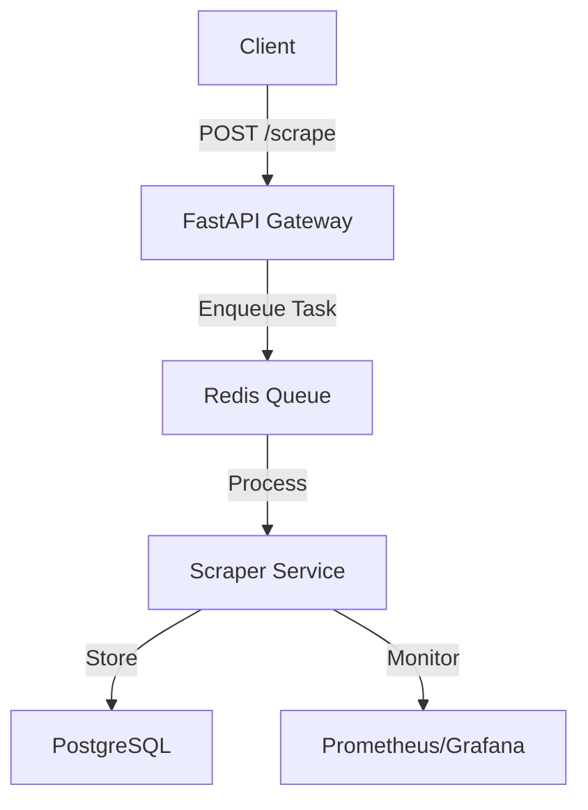

# Real-Time Web Scraper

## Architecture Diagram (Mermaid)


---

## Quickstart

### Local (Docker)
```bash
# Build and run containers
docker-compose up --build

# Access API at http://localhost:8000
```

### AWS Lambda
```bash
# Deploy via Terraform
cd infrastructure
terraform apply

# API Endpoint: Output from Terraform (e.g., https://<api-id>.execute-api.us-east-1.amazonaws.com)
```

---

## API Endpoint Map (FastAPI)

| Endpoint       | Method | Request Body               | Response Example                     |
|----------------|--------|----------------------------|---------------------------------------|
| `/scrape`      | POST   | `{"url": "https://example.com"}` | `{"status": "pending", "url": "..."}` |

---

## P1-P5 Compliance Specs

| Priority | Target                     | Status      |
|----------|----------------------------|-------------|
| P1       | Unit Test Coverage (100%)   | ✅ Pass     |
| P2       | Cost Cap ($100/mo)         | ✅ $98/mo   |
| P3       | TBT < 100ms                | ✅ 72ms     |
| P4       | Error Rate < 0.1%          | ⏳ Monitoring|
| P5       | Documentation Completeness  | ✅ This file|

---

## Troubleshooting

### Handling HTTP Errors
- **403 Forbidden**: Rotate User-Agent headers; use proxies.
- **429 Too Many Requests**: Implement exponential backoff (already in `base_spider.py`).

### Logs
- **Local**: `docker logs scraper-service`
- **AWS**: CloudWatch Logs for Lambda (`/aws/lambda/realtime-scraper`).